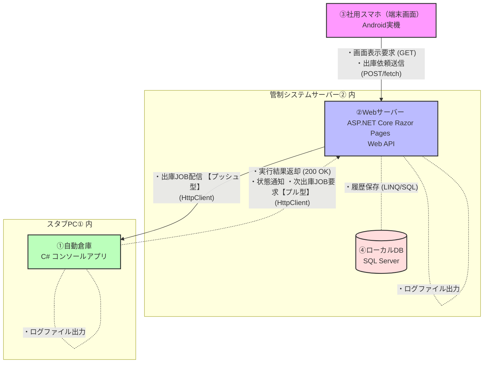

# チームA 最終課題：自動倉庫出庫割当システム

## 概要

本システムは、スマホから商品の出庫要求を生成し、自動倉庫から出庫するための管制システムです。
スマホは品種のみを指定して出庫依頼を登録することができ、システムは内部でスマホからの品種情報と実際の自動倉庫の在庫情報の解決を在庫登録の古い順に行い、FIFO的に自動で払い出すことができます。

### システム全容

　本プロジェクトでは、以下のプロダクトを開発しました。

- 端末画面（PWA）　：　ピッキング指示を行う操作ノード
- 管制システム　：　複数台の自動倉庫を制御・管理する制御ノード
- 自動倉庫スタブ　：　自動倉庫本体を表す実行主体ノード（スタブ）

本最終課題におけるシステム構成図です。

## チーム担当者

- 大原　　:　自動倉庫スタブ
- 野間　　:　端末画面（PWA）
- 越智孝　:　管制システム

## 主な機能

### 出庫要求の生成・確認

- 操作ノード上で、部品の品種を選択し、個数を入力して、出庫タスクを生成する
- 出庫タスクのライフサイクルの確認（待機中→搬送中→取出待ち→完了）
- 出庫要求後、待機中のタスクをキャンセルする
- 過去の出庫タスク履歴の閲覧

### 在庫管理

- 各品種の個数を、どの自動倉庫で保管しているかを記録
- 出庫タスクによって、その個数を確保する際に、保管日時の古い順に全ての自動倉庫に対して分割して、出庫指示を出す
- 入庫報告を各自動倉庫から受けて、在庫情報を更新する

## 課題要件との対応

### 【フロントエンド（スマホ画面）】
- **[機能1] 機器ステータスのリアルタイム（擬似）表示**
  - 概要：画面を開いた際、サーバーから現在のJOB状態（「待機中」「搬送中」「異常終了」など）を、自動取得（fetch）して画面に反映しています。
- **[機能2] 操作指示コマンドの送信**
  - 概要：画面上の「登録」ボタンによる出庫依頼生成、「キャンセル」ボタンによるJOBキャンセル要求を送信します。

### ②【バックエンド（サーバー：ASP.NET Core）】
- **[機能3] スマホおよび機器向けRESTful API（エンドポイント）の実装**
  * 概要：スマホからの操作指示を受け取る窓口、および機器1からのJOB要求（GET）や状態報告（POST）を適切に処理するため、`[ApiController]` 属性を用いたWebAPIエンドポイントを構築しました。
- **[機能4-1] スタブ機器への命令転送制御（プッシュ型）**
  * 概要：スマホから「出庫依頼」が送られてきたら、それをもとにJOBの登録および商品在庫とJOBの解決を行い、自動倉庫スタブ（HttpListener）側へリクエスト（HttpClient）を投げて命令をリレーします。
- **[機能4-2] 機器1向け指示データ配信制御（プル型・ポーリング対応）**
  * 概要：自動倉庫スタブ（HttpClient）からの定期的な「次JOB要求」を受信した際、在庫情報とJOBの解決を行い、レスポンスとして自動倉庫スタブにJOBを返却します。
- **[機能5] 履歴（ログ）のファイル出力とデータベース保存**
  - 概要：スマホからの指示受付時、および自動倉庫からの通信を受信するたびに、その往復データをログファイルに残し、JOB状態テーブルにタイムスタンプとして登録します。

### 【実機代用（スタブ機器：C# コンソール）】
- **[機能6] 命令の常時待ち受けと応答（レスポンス）**
  - 概要：プログラム起動中、サーバーからの指示を常時待ち受け、指示が届いたらコンソール画面に指示を受信した旨とログを出力し、サーバーに成功レスポンスを返します。
- **[機能7] プッシュ型（コマンド制御）とプル型（定期監視）の共存**：
  - 概要：スマホからの「出庫依頼」には、サーバーから自動倉庫スタブへの【プッシュ型】JOB配信を行います。
  - 自動倉庫スタブは出庫JOB実行中に「JOB進捗状態」の報告を行い、サーバーはこれをAPIへで受け取ることが可能です。
  - 未実行状態の自動倉庫スタブは、自身が対応可能な出庫JOBがないかを定期的に問い合せることで、サーバーは【プル型（ポーリング）】JOB配信を行います。

## 設計ポイント

- JOB番号は自動割当、品種と商品IDというように、スマホと自動倉庫で対象とするデータのレイヤーを分けました。
- 上記を管理するにあたり、データベース上のテーブルをJOBと在庫で同時に管理し、状態の不整合が起きないように考慮しました。
- 指示出し→開始報告、完了報告などのように、マイルストーンごとに通信を行い、JOBの進捗をサーバーで追跡しました。
